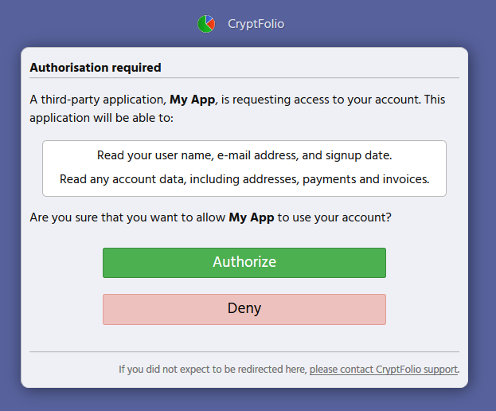

[< Back](../)

# Sample authorisation screen

When you use OAuth2 to request access to a users' account, they will be presented (when you redirect them to `auth_url`) with a screen such as this one:



# Sample authorisation code

### Ruby

Authentication and authorisation is easy with [the oauth2 gem](https://github.com/oauth-xx/oauth2).

```rb
def oauth2_client
  OAuth2::Client.new('<your key>',
    '<your secret>',
    site:          "https://preview.cryptfolio.com",
    token_url:     "/oauth/token",
    authorize_url: "/oauth/authorize")
end

auth_url = oauth2_client.auth_code.authorize_url(redirect_uri: '<your redirect uri>', scope: 'public read')

# At this point, you would redirect the user to auth_url. CryptFolio will handle
# login and authorisation, and once successful, redirects the user to the redirect_uri
# with a code. i.e. /redirect_uri?code=ABC123

# The flow then continues:

code = params[:code]
token = oauth2_client.auth_code.get_token(code, redirect_uri: '<your redirect uri>')

# And then you can use the token as any other endpoint.

currencies = token.get("/api/v1/currencies")
user_info = token.get("/api/v1/user")
```

We implement refresh token rotation, which means that every access token refresh request, we will issue a new refresh token. Previous tokens are invalidated (revoked) only once the access token is used. For refreshed access tokens, the scopes are identical from the previous access token.

### Testing

To run the [rspec OAuth2 tests](../spec/) in this project, you will need to:

1. Create a new OAuth registered application, with all scopes except `admin`, on a plan which supports more than 5 portfolios
2. Create a new user with an email/password
3. Send a support request to CryptFolio to enable username/password login with OAuth2 (this is disabled by default)

You can then create a local `.env` file with the necessary information, which `rspec` will load at runtime, e.g.:

```env
HOST: "https://preview.cryptfolio.com"

OAUTH2_KEY: "<your key>"
OAUTH2_SECRET: "<your secret>"
OAUTH2_REDIRECT_URI: "http://localhost:3000/api" # this is not used with username/password login

TEST_USER_EMAIL: "test@openclerk.org"
TEST_USER_PASSWORD: "password"
TEST_USER_NAME: "Test"
```
